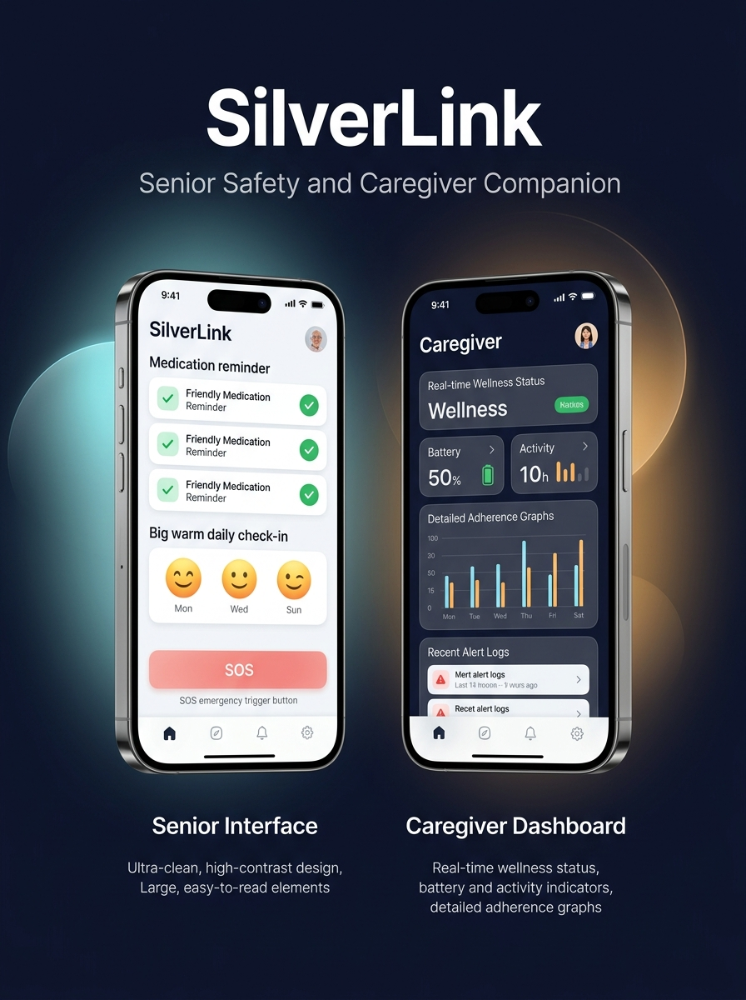

# SilverLink

<p align="center">
  
</p>

SilverLink is an accessibility-first companion app connecting senior citizens with their family caregivers. It pairs an ultra-simple interface for seniors with a real-time status and medication dashboard for caregivers.

---

## Features

### Senior Mode
- **Accessibility-First UI**: High contrast, large fonts, and big tap targets.
- **Medication Schedule**: Daily list of medicines grouped by time of day with one-tap confirmations.
- **Daily Check-In**: Quick mood and symptom logging.
- **Emergency SOS**: Fast emergency trigger with a safety countdown to prevent accidental alerts.
- **Voice Assistant**: Hands-free voice commands using speech recognition and audio feedback.
- **Family Contacts**: Quick call buttons for family members and doctors.

### Caregiver Dashboard
- **Live Status**: Real-time view of daily check-ins, battery level, and last active time.
- **Medication Management**: Add, edit, or remove prescriptions and monitor adherence.
- **Alerts**: Instant notifications for missed doses, low check-ins, or SOS triggers.

---

## Tech Stack

- **React Native** & **Expo** (SDK 51)
- **TypeScript**
- **React Navigation**
- **Firebase** (Firestore & Auth) with local offline fallback
- **Web Speech API** (Speech Recognition & TTS)

---

## Getting Started

### Prerequisites
- Node.js (v18 or higher)
- npm

### Setup

```bash
# Clone the repository
git clone https://github.com/varshithaaaagedda/silverlink.git
cd silverlink

# Install dependencies
npm install --legacy-peer-deps

# Run web version
npm run web

# Or run mobile version
npm run start
```

---

## Demo Accounts

The app includes one-tap demo profiles on the login screen:
- **Senior**: Eleanor Vance (Age 78)
- **Caregiver**: Sarah Vance (Daughter)

You can also switch roles at any time from the app header or settings.
